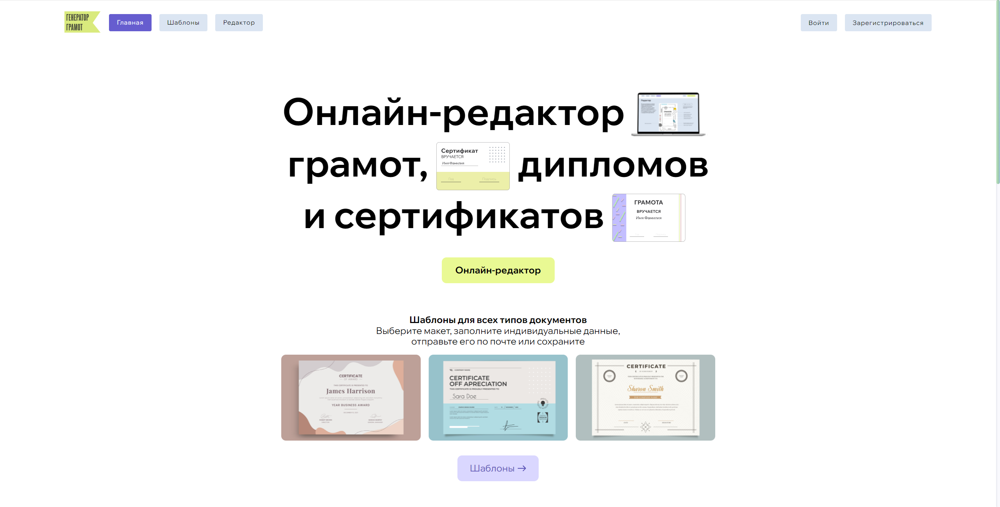
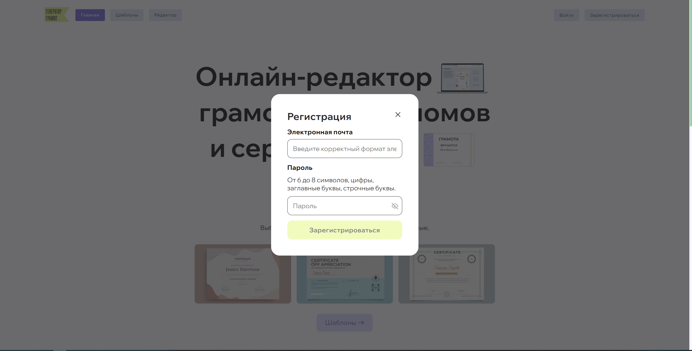
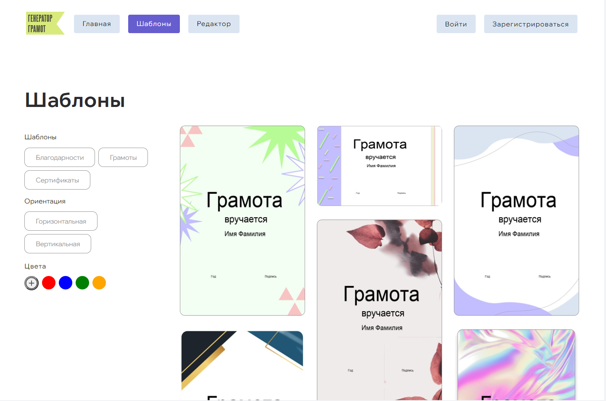
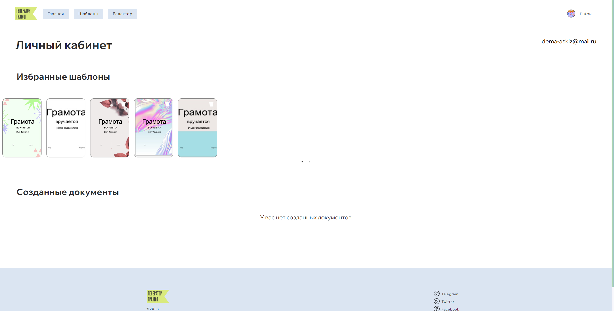
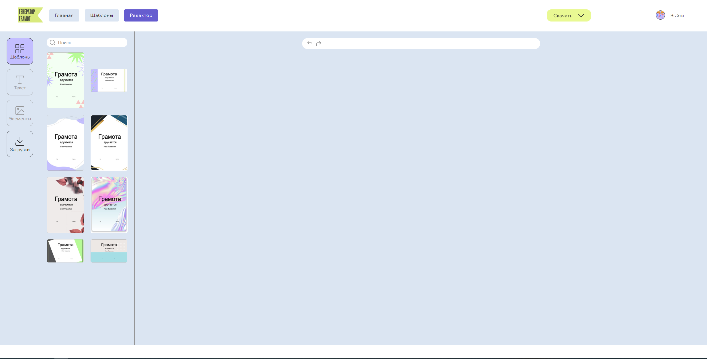
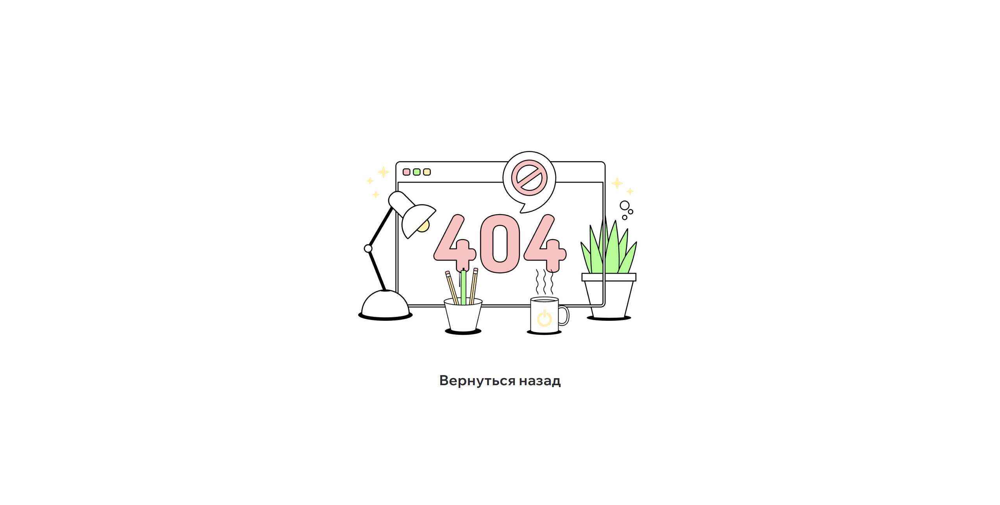

<h1 align="center"> Приложение "Генератор грамот"</h1>

## Test

- **Скопируйте <a href="https://github.com/certificates-and-commendations/frontend">frontend</a> репозиторий**
- **Команды для запуска "npm install", "npm run start"**

## Описание приложения

Онлайн-конструктор для создания грамот и благодарностей. Выбор как готовых шаблонов так и возможность загрузки собственных, редактор текста , загрузка подписи и печати. Скачиване готового шаблона.

## Figma

https://www.figma.com/file/lET38RfIXulKssgo1hB0hI/Грамоты?type=design&node-id=1863-30946&mode=design&t=nNyjGVOoonO4XPbj-0

## Технологии:

- **CSS BEM**
- **HTML**
- **React**
- **JS**

## Регистрация

### Зарегистрируйте свою учетную запись!

- **Введите адрес электронной почты**
- **Введите пароль**
- **Плучите код подтвердение на ваш эектронный адрес**

## Раздел с загруженными шаблонами

## Страница личного кабинета

## Редактор грамот

## Страница ошибки

